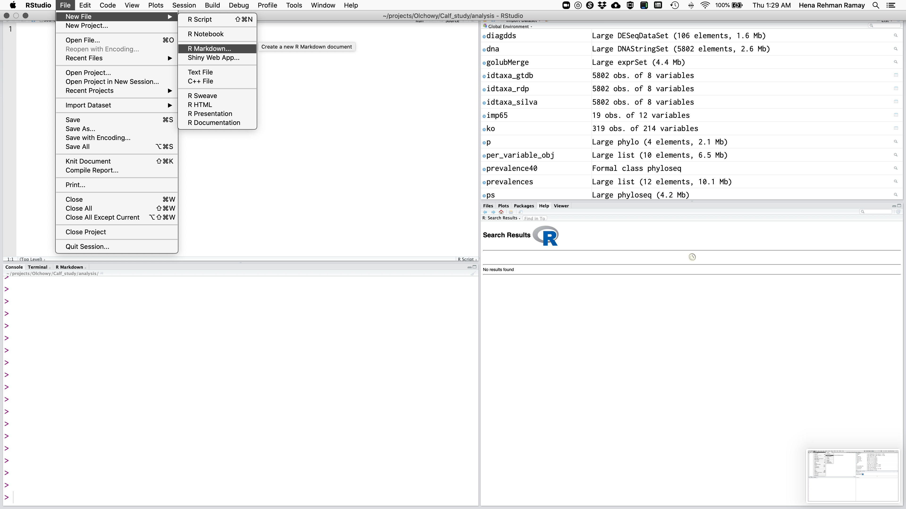
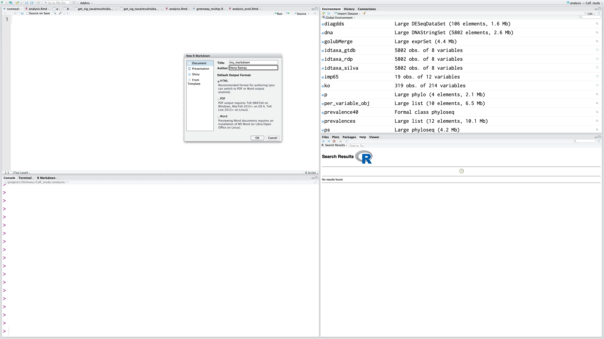
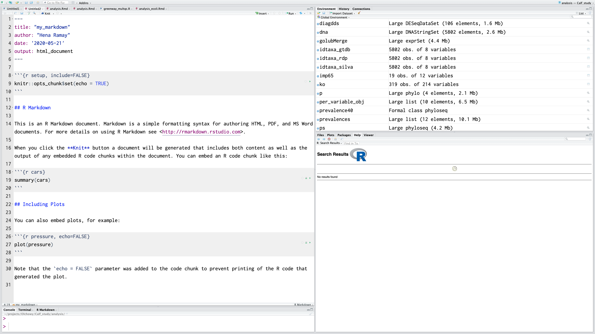
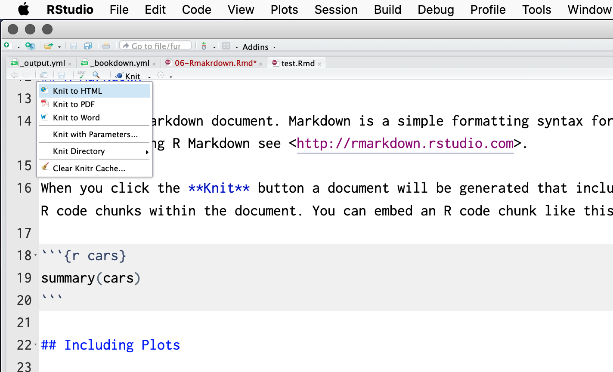

# Rmarkdown

“If I went back to college again, I’d concentrate on two areas: learning to write and to speak before an audience. Nothing in life is more important than the ability to communicate effectively.”
– Gerald R. Ford

<br>

<div class="box">
#### Learning Objectives {-}
Learn how to generate reproducible reports that display your code and results.
</div>

## Set up new R Markdown file

When you perform wet lab experiments, what information do you put in your lab notebook? You probably include the protocol you used to run the experiment, information about the samples and reagents used in the protocol, and at the end you'll likely include your results (for instance, a picture of a gel). This essentially creates a report of your experiment.

You can do the same with your dry lab analyses using a tool called R Markdown. Why would we want to do this?

-   Your method, results, and interpretation are stored in one place

-   If you update your methodology, you can easily update your results with the click of a button, rather than copying and pasting.

-   *DONOT* cut and paste your code and results into Word or Power Point as Word often introduces hidden characters and it is not good practice to save your code in Word instread of an R script.
<br>

R Markdown is a fairly simple language you can use to generate reports that incorporate bits of R code along with the output they produce. There are two steps to generating reports with R Markdown and RStudio:

1.  Write your code in R Markdown.
2.  Assemble your report as either HTML or a PDF using the package rmarkdown.

<br>

Next, let's run through the demo R Markdown file to see some of the options. Go up to `File` -> `New File` -> `R Markdown`.




A screen will pop up asking us what kind of document we wish to create. Let's name our demo report "Trial Report" and fill in your name. Ensure that "Document" is highlighted to the left and that "HTML" is chosen. Click "Ok".




Now we have the example R Markdown file open. The first thing you'll notice at the top is a header which includes your name, the title of the document, the date, and a field called output. This header tells the package rmarkdown some information it might need about your document, including what format you want the final report rendered in.

The next thing you'll notice is white space with some text describing an R Markdown document. White space in this document represents text of the report you would like to display. You can put anything here describing your analysis, results, etc. and it will be recognized as text and not R code. This white space is interpreted as Markdown language, so you can use any of the tricks we learned in the last lesson to make lists, bold certain words, or create headers in your document.

In this trial script, you'll see how some of these markdown elements are used. For example, the word knit is in bolded (using asterisks), and there are code chucks near the bottom that say echo = FALSE.



### R Markdown componenets

Notice that the file contains three types of content:

1. An (optional) YAML header surrounded by ---s
2. R code chunks surrounded by ```s
3. text mixed with simple text formatting

In addition to the white space, you'll gray blocks that have ``` at the top and bottom. These are called chunks. If the start of a chunk has {r} at the end of the ticks, the code will be run and both it and its output will be displayed in the rendered HTML. In your R Markdown, the code will look like:

<pre>
```{r, eval=F}
summary(cars)
```
</pre>

In your final report, the code will look like:

```
summary(cars)
```


Let's add a new chunk to end this demo document. To do so, either you can enter three backticks in a row, followed by {r}, or you can click on the green `Chunks`button and chose`Insert Chunk`. Additionally, there's a keyboard short cut which is `ctrl`+`alt`+`i`which will also pop up a chunk in an R Markdown document.

<!--  -->


In the chunk, let's just examine the dimensions of the `car`mdataset:

<pre>```{r}
dim(cars)
```</pre>

You can actually send the code straight from the chunks over to console to be evaluated in two ways. First, you can highlight the code you want to run in the chunk and hit the `Run` button, which is located in the top right corner of the pane. 

### Knit R Markdown

These are the basics of writing R Markdown, but we still need to generate a report. To do this, click on the button on the top bar that says "Knit HMTL". This will prompt you to save the file. Go ahead and save this file as `Rmarkdown_demo.Rmd` in the altmetrics directory. The ending of the file `.Rmd` indicates that this is an R Markdown file.




When you click on this link, you see in the console that RStudio is running and rendering your R Markdown file. What is actually happening is RStudio is running the function `render`, which is part of the rmarkdown package. There are two things the command `render` does. First, it converts the R Markdown file to a Markdown file using the command `knit` from the knitr package (hence why rendering is called knitting). The second step is then the Markdown file is converted to the final file format (HTML, PDF, or Word).

The final result is that an HMTL file will pop up where you'll see the report. You can see the header has been rendered, there are code and results chunks displayed, and even plots are shown right in the report.

Also, if you now look in the altmetrics folder, you'll see an HTML file of the name Rmarkdown_demo.html. When `render` is run, it saves the current version of the .Rmd file and the generated HTML file in the directory it is stored in.


<div class="box">

#### Exercise {-}

1. Create a new project for this workshop.
2. In this project create a new markdown file called rworkshop.Rmd
3. Change the name of author to yours.
4. Click on the settings icon next to the knit button and go to output options. Try different themes and see how it changes you html output. Chose a theme that you like!
</div>


## Knitr Chunk Options

<div class="box">
#### Learning Objectives {-}

Learn how to format chunks in R Markdown to display only the information you want to display.
</div>
<br>

You've learned the basics of how to incorporate markdown syntax with code chunks in an R Markdown file. Let's explore some additional options for making your code chunks appear the way you want them to appear in your reports. There are many ways to customize your chunks and you can explore all of the options by examining the [documentation](http://yihui.name/knitr/options/#chunk_options). Here, we'll introduce you to some of the most useful options that you might use frequently.

Chunk output can be customized with [knitr options ⧉](http://yihui.name/knitr/options/), arguments set in the `{}` of a chunk header. Above, we use five arguments:

-   `include = FALSE` prevents code and results from appearing in the finished file. R Markdown still runs the code in the chunk, and the results can be used by other chunks.
-   `echo = FALSE` prevents code, but not the results from appearing in the finished file. This is a useful way to embed figures.
-   `message = FALSE` prevents messages that are generated by code from appearing in the finished file.
-   `warning = FALSE` prevents warnings that are generated by code from appearing in the finished.
-   `fig.cap = "..."` adds a caption to graphical results.


The first thing you may want to consider is naming your code chunks, which makes degubbing easier, especially if you have a long script. Chunk names must be unique to each chunk.

Write the name of your chunk after the {r}, like: `{r chunk_name}`

R Markdown:

<pre> ```{r chunky_monkey}
summary(cars)
``` </pre>
Rendered:

```{r chunky_monkey}
summary(cars)
```


You can use RStudio to navigate to chunks based on their names, which can be especially useful as your script gets long. Click on the bottom left bar where it says `(Top Level)` and you'll see all of the chunk names in your script appear. Additionally, naming your chunks will be beneficial to identify errors in your code or slow sections when knitting your report.

Sometimes you may not want to see the code that produced a particular result in your report. You can have codeblocks in your R Markdown that are evaluated, but the code is not displayed in the final report by including `echo=FALSE` after the `{r chunk_name}`.

R Markdown:

<pre>```{r funky_monkey, echo=FALSE}
summary(cars)
```</pre>

Rendered:

```{r funky_monkey, echo=FALSE}
summary(cars)
```

Conversely, sometimes you may want to see the code, but not the output once the code is evalutated. To do so, you can include `results="hide"` after the chunk_name:

R Markdown:

<pre>```{r brass_monkey, results="hide"}
summary(cars)
```</pre>

Rendered:

```{r brass_monkey, results="hide"}
summary(cars)
```

Sometimes, you may want to write a report where both the code and the output are suppressed. Why would you want to do that? Perhaps you're sending a report to a collaborator and you only want them to see the final figures, but not any data manipulation steps in the middle. To include a chunk that is evaluated, but no output is displayed - neither the code nor the results - put `include=FALSE` after the chunk_name:

R Markdown:

<pre>```{r brass_section, include=FALSE}
summary(cars)
```</pre>

Rendered (I swear there's a chunk after this! It's just invisible!):

There are tons of other options you can include in your chunks: sizing your figures and whether or not to display error or warning messages. As you write reports of your own data analysis, you can look up these options to create a report formatted in the way you want.

In addition to code chunks, you may want to include the results of an evaluation in line with regular text. For instance, you may want to describe the data in a paragraph, and include the number of individuals in that paragraph. To do so, you can indicate that a code box should be evaluated as R by including a lowercase r.

R Markdown:

```
The _cars_ dataset included in this analysis contains records for `r '\x60r dim(cars)[1]\x60'` cars. 
```

Rendered:

```
The _cars_ dataset included in this analysis contains records for `r dim(cars)[1]` cars.
```


<div class="box">

#### Exercise {-}

Now that you are familiar with chunks, create a chunk in which you do sum=1+1. Now by searching on the web, how can you re-use this chunk later in your rmd file. 


</div>
