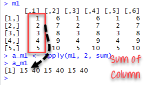

# The apply family


<div class="box">
#### Learning Objectives {-}
Learn to use apply family functions in place of loops.
</div>


Whenever you're using a for loop, you might want to revise your code and see whether you can use the lapply function instead. Learn all about this intuitive way of applying a function over a list or a vector, and its variants sapply and vapply.


## apply()

apply() takes Data frame or matrix as an input and gives output in vector, list or array. apply() Function is primarily used to avoid explicit uses of loop constructs. It is the most basic of all collections can be used over a matrice.

This function takes 3 arguments:

    apply(X, MARGIN, FUN)

apply() takes an array or matrix `X`, a `Margin` that takes a value 1 for rows or 2 for columns and applies a functoin `FUN` to it.

```{r}
m1 <- matrix(C<-(1:10),nrow=5, ncol=6)
m1
a_m1 <- apply(m1, 2, sum)
a_m1
```





<div class="box">
#### Exercise {-}
Select the columns from count.raw file from pdfDownloadsCount to hmtlDownloadsCount and using the apply function find the mean  of each column.

<!-- # ```{r} -->
<!-- # counts<-read.table("img/counts-raw.txt",header = T) -->
<!-- # counts %>% select(pdfDownloadsCount:htmlDownloadsCount) %>% apply(.,2,mean) -->
<!-- # ``` -->

</div>
<br>


## lapply()

Before you go about solving the exercises below, have a look at the documentation of the `lapply()` function. The Usage section shows the following expression:

    lapply(X, FUN, ...)

To put it generally, `lapply` takes a vector or list `X`, and applies the function `FUN` to each of its members. If `FUN` requires additional arguments, you pass them after you've specified `X` and `FUN` (`...`). The output of `lapply()` is a list, the same length as `X`, where each element is the result of applying `FUN` on the corresponding element of `X`.

Now that you are truly brushing up on your data science skills, let's revisit some of the most relevant figures in data science history. We've compiled a vector of famous mathematicians/statisticians and the year they were born. Up to you to extract some information!

#### Example

```{r}
# The vector pioneers has already been created for you
pioneers <- c("GAUSS:1777", "BAYES:1702", "PASCAL:1623", "PEARSON:1857")

# Split names from birth year to make split_math a list
split_math <- strsplit(pioneers, split = ":")
# Convert to lowercase strings: split_low
split_low <- lapply(split_math, tolower)
# Take a look at the structure of split_low
str(split_low)
```


### Use lapply with your own function

You can use `lapply()` on your own functions as well. You just need to code a new function and make sure it is available in the workspace. After that, you can use the function inside `lapply()` just as you did with base R functions. We have already created a select_first() function so lets apply it to a


<div class="box">
#### Exercise {-}
Use lapply on split_low list and use the select_first() function you created.

</div>

<!-- ```{r} -->
<!-- select_first <- function(x) { -->
<!--   x[1] -->
<!-- } -->
<!-- # Apply select_first() over split_low: names -->
<!-- names <- lapply(split_low, select_first) -->
<!-- ``` -->


### lapply and anonymous functions

Writing your own functions and then using them inside `lapply()` is quite an accomplishment! But defining functions to use them only once is kind of overkill, isn't it? That's why you can use so-called **anonymous functions** in R.

Previously, you learned that functions in R are objects in their own right. This means that they aren't automatically bound to a name. When you create a function, you can use the assignment operator to give the function a name. It's perfectly possible, however, to not give the function a name. This is called an anonymous function:

    # Named function
    select_first <- function(x) { x[1] }

    # Use anonymous function inside lapply()
    lapply(list(1,2,3), function(x) {x[1]})

#### Example

```{r}
# Transform: use anonymous function inside lapply
names <- lapply(split_low, function(x) { x[1] })

```


### Use lapply with additional arguments

In the video, the `triple()` function was transformed to the `multiply()` function to allow for a more generic approach. `lapply()` provides a way to handle functions that require more than one argument, such as the `multiply()` function:

    multiply <- function(x, factor) {
      x * factor
    }

    lapply(list(1,2,3), multiply, factor = 3)

On the right we've included a generic version of the select functions that you've coded earlier: `select_el()`. It takes a vector as its first argument, and an index as its second argument. It returns the vector's element at the specified index.

#### Example

```{r}
# Generic select function
select_el <- function(x, index) {
  x[index]
}
# Use lapply() twice on split_low: names and years
names <- lapply(split_low, select_el, index = 1)
years <- lapply(split_low, select_el, index = 2)
```


## sapply()

You can use `sapply()` similar to how you used `lapply()`. sapply is a user-friendly version and wrapper of lapply by default returning a vector, matrix .The first argument of `sapply()` is the list or vector `X` over which you want to apply a function, `FUN`. Potential additional arguments to this function are specified afterwards (`...`):

    sapply(X, FUN, ...)


#### Example

```{r}
# Constructing temp variable
names <- sapply(split_low, select_el, index = 1)
```


### sapply with your own function

Like `lapply()`, `sapply()` allows you to use self-defined functions and apply them over a vector or a list:

    sapply(X, FUN, ...)

Here, `FUN` can be one of R's built-in functions, but it can also be a function you wrote. This self-written function can be defined before hand, or can be inserted directly as an anonymous function.

### sapply with function returning vector

In the previous exercises, you've seen how `sapply()` simplifies the list that `lapply()` would return by turning it into a vector. But what if the function you're applying over a list or a vector returns a vector of length greater than 1? If you don't remember from the video, don't waste more time in the valley of ignorance and head over to the instructions!

#### Example

```{r}
temp=list(c(1,3,4,4,6),c(3,4,6,8,9))
# Create a function that returns min and max of a vector: extremes
extremes <- function(x) {
  c(min = min(x), max = max(x))
}
# Apply extremes() over temp with lapply()
lapply(temp, extremes)
# Apply extremes() over temp with sapply()
sapply(temp, extremes)
```


### sapply can't simplify, now what?

It seems like we've hit the jackpot with `sapply()`. On all of the examples so far, `sapply()` was able to nicely simplify the rather bulky output of `lapply()`. But, as with life, there are things you can't simplify. How does `sapply()` react?

We already created a function, `below_zero()`, that takes a vector of numerical values and returns a vector that only contains the values that are strictly below zero.

#### Example 

```{r}
# temp is already prepared for you in the workspace
# Definition of below_zero()
below_zero <- function(x) {
  return(x[x < 0])
}
# Apply below_zero over temp using lapply(): freezing_l
freezing_l <- lapply(temp, below_zero)
# Apply below_zero over temp using sapply(): freezing_s
freezing_s <- sapply(temp, below_zero)
# Are freezing_l and freezing_s identical?
identical(freezing_l, freezing_s)
```


## vapply()

Before you get your hands dirty with the third and last apply function that you'll learn about in this intermediate R course, let's take a look at its syntax. The function is called `vapply()`, and it has the following syntax:

    vapply(X, FUN, FUN.VALUE, ..., USE.NAMES = TRUE)

Over the elements inside `X`, the function `FUN` is applied. The `FUN.VALUE` argument expects a template for the return argument of this function `FUN`. `USE.NAMES` is `TRUE` by default; in this case `vapply()` tries to generate a named array, if possible.

For the next set of exercises, you'll be working on the `temp` list again, that contains 7 numerical vectors of length 5. We also coded a function `basics()` that takes a vector, and returns a named vector of length 3, containing the minimum, mean and maximum value of the vector respectively.

#### Example
```{r}
# temp is already available in the workspace
# Definition of basics()
basics <- function(x) {
  c(min = min(x), mean = mean(x), max = max(x))
}
# Apply basics() over temp using vapply()
vapply(temp, basics, numeric(3))
```


<div class="box">
#### Exercise

```article<-list(counts$year,counts$articleType)```
<br>
Use the table() function and one of the apply functions to see how many counts of each year and articleType are available. 
Explain which function you used and what does the output look like?

</div>


