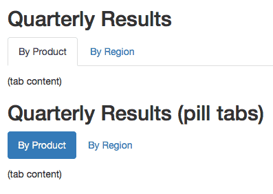

# Advanced Rmardown
So far we have use default settings to create our rmarkdown documents. Lets **prettify** our documents!!


## YAML options for HTML documents
As we just mentioned before, Markdown was originally designed for HTML output, so it may not be surprising that the HTML format has the richest features among all output formats. We recommend that you read this full section before you learn other output formats, because other formats have several features in common with the HTML document format, and we will not repeat these features in the corresponding sections.

To create an HTML document from R Markdown, you specify the html_document output format in the YAML metadata of your document:

```{js}
---
title: first_markdown
author: ME ME
date: March 22, 2005
output: html_document
---
```


Lets add themes and highlight options

```{js}
title: first_markdown
author: ME ME
date: March 22, 2005
output: 
  html_document:
    theme: yeti
    highlight: kate
```

Now lets add a table of contents

```{js}

title: first_markdown
author: ME ME
date: March 22, 2005
output: 
  html_document:
    theme: yeti
    highlight: kate
    toc: true
    toc_float: 
      collapsed: false
    toc_depth: 4
```

 if you want to hide your code

```{js}
title: first_markdown
author: ME ME
date: March 22, 2005
output: 
  html_document:
    theme: yeti
    highlight: kate
    toc: true
    toc_float: 
      collapsed: false
    toc_depth: 4
    code_folding: hide
```

A way to add custom css

```{js}
title: first_markdown
author: ME ME
date: March 22, 2005
output: 
  html_document:
    theme: yeti
    highlight: kate
    css: styles.css
    toc: true
    toc_float: 
      collapsed: false
    toc_depth: 4
    code_folding: hide

```


## Cool stuff in rmarkdown
<br> 
### CHEATSHEET
This cheat sheet has all the details on how to add figures, links, bullets, headings and tables in rmarkdown!
[](img/rmarkdown-2.0.pdf)
<br> 
<br> 
### Making cools tables in rmarkdown from R code
Tables generated from your R code are very useful to share modified output with other users.
Simplest tables in markdown can be generated using the kable function but these table are static and to be honest boring!
<br> 
#### A kable table
```
library(knitr)
kable(cars)
```

```{r}
knitr::kable(cars)
```
<br> 
#### A DT table

```
library(DT)
datatable(cars)
```

```{r}
library(DT)
datatable(cars)
```

<br> 
#### DT table with download options
```
library(DT)
datatable(cars,
  extensions = 'Buttons', options = list(
    dom = 'Bfrtip',
    buttons = c('copy', 'print','csv', 'excel')
  )
)
```
<br> 

```{r}
library(DT)
datatable(cars,
           extensions = 'Buttons', options = list(
    dom = 'Bfrtip',
    buttons = c('copy', 'print','csv', 'excel')
    )
)
```


<br> 
<br> 

### Making tabs in rmarkdown
You can organize content using tabs by applying the .tabset class attribute to headers within a document. This will cause all sub-headers of the header with the .tabset attribute to appear within tabs rather than as standalone sections. For example:

<br> 

```
## Quarterly Results {.tabset}

### By Product

(tab content)

### By Region

(tab content)
```

<br>

You can also specify two additional attributes to control the appearance and behavior of the tabs. The .tabset-fade attribute causes the tabs to fade in and out when switching between tabs. The .tabset-pills attribute causes the visual appearance of the tabs to be “pill” rather than traditional tabs. For example:

<br> 



<br> 
<br> 
## HTML and CSS basics
HTML, **HyperText Markup Language**, gives content structure and meaning by defining that content as, for example, headings, paragraphs, or images. CSS, ** Cascading Style Sheets**, is a presentation language created to style the appearance of content—using, for example, fonts or colors.

Lets look at the following examples

[Simple html generated from rmarkdown](data/case_study_default.html)

[Simple html styled by css from themes](data/case_study_theme.html)

[Simple html styled by custom css](data/case_study_extreme.html)

<br> 
<br> 
### HTML
```
<!DOCTYPE html>
<html>
<body>

<h1>My First Heading</h1>
<p>My first paragraph.</p>

</body>
</html>
```

####Output:

<h1>My First Heading</h1>
<p>My first paragraph.</p>


You will not have to worry about html too much in rmarkdown. However,
once in a while you might want to add color to some text or other simple things:

```
<p style="color:tomato">My first paragraph.</p>

```

**Output**

<p style="color:tomato">My first paragraph.</p>


```
<p style="color:tomato;font-family:verdana">My first paragraph.</p>

```
**Output**

<p style="color:tomato;font-family:verdana">My first paragraph.</p>

I use <br> a lot which means adds a single break meaning a extra empty line

There are options for highlighting, bold, italic etc


To learn more html go to https://www.w3schools.com/default.asp .

<br> 
<br> 

### CSS
- CSS stands for Cascading Style Sheets
- CSS describes how HTML elements are to be displayed on screen, paper, or in other media
- CSS saves a lot of work. It can control the layout of multiple web pages all at once
- External stylesheets are stored in CSS files


#### CSS Syntax
A CSS rule-set consists of a selector and a declaration block:


- The selector points to the HTML element you want to style.

- The declaration block contains one or more declarations separated by semicolons.

- Each declaration includes a CSS property name and a value, separated by a colon.

- Multiple CSS declarations are separated with semicolons, and declaration blocks are surrounded by curly braces.


```{asis}
p {
  color: red;
  text-align: center;
}

```

- p is a selector in CSS (it points to the HTML element you want to style: <p>).
- color is a property, and red is the property value
- text-align is a property, and center is the property value


 To learn more visit https://www.w3schools.com/css/css_syntax.asp

